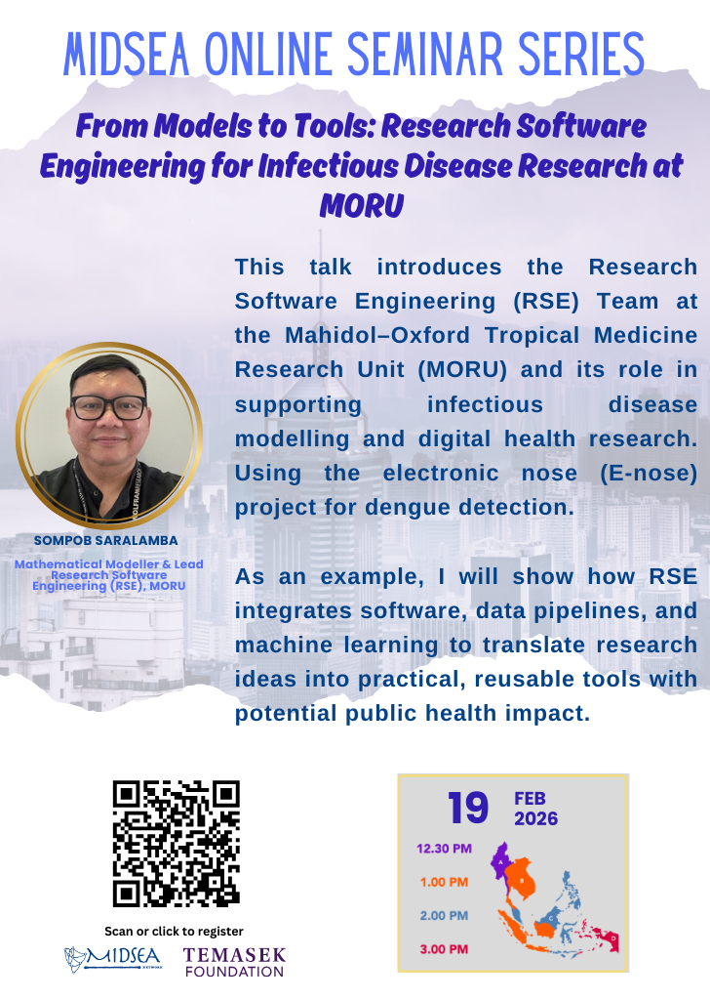

---
# ── Copy this file into the events/ folder and rename it, e.g. events/2026-01-my-event.qmd ──
title: "From Models to Tools: Research Software Engineering for Infectious Disease Research at MORU"
date: 2026-02-15
# For date ranges, use the start date above and describe the range in
# event-dates below so it displays nicely, e.g. "22 - 29 June 2026".
event-dates: "19 February 2026"
location: "Online"
image: ../images/events/webinar-research/20260219-trimmed.jpg
description: "Research Webinar series"
categories: [Online Events, Seminars, Past]
# Pick one or more tags from: Online Events, Seminars, Summer School.
# Also add "Upcoming" or "Past" so the filter chips on the Events page work,
# e.g. categories: [Seminars, Upcoming]
---

